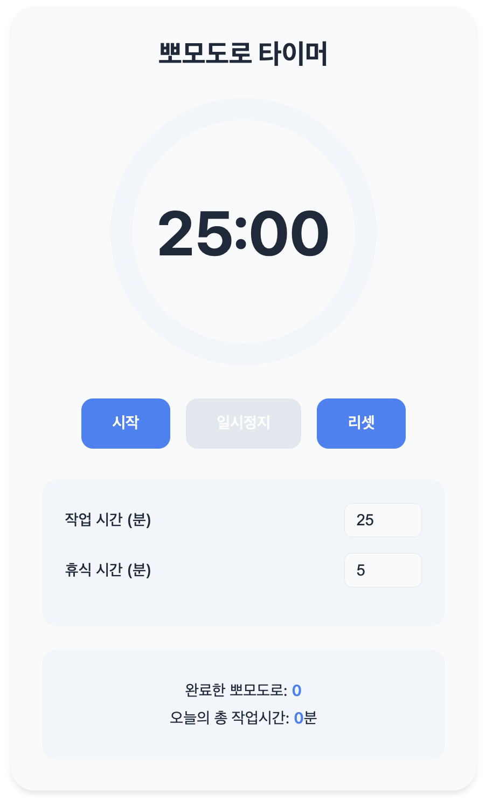

# 뽀모도로 타이머 (Pomodoro Timer)

효율적인 시간 관리를 위한 **뽀모도로 타이머**입니다. 작업 시간과 휴식 시간을 설정하여 집중적인 작업을 진행할 수 있습니다. 직관적이고 깔끔한 인터페이스를 제공하며, **라이트/다크 테마** 전환 기능도 지원합니다.

---

## 📸 스크린샷

---

## 🔧 기능

- **작업 시간 설정**: 원하는 작업 시간을 설정하여 타이머를 시작할 수 있습니다.
- **휴식 시간 설정**: 작업 후 휴식 시간을 설정할 수 있습니다.
- **타이머 기능**: 실시간으로 시간을 추적하며, 원형 프로그레스 바를 통해 남은 시간을 확인할 수 있습니다.
- **테마 전환**: 라이트 모드와 다크 모드 간에 테마를 쉽게 전환할 수 있습니다.
- **통계**: 완료한 뽀모도로 수와 오늘의 총 작업 시간을 추적합니다.
- **일시정지 및 리셋**: 타이머를 일시정지하거나 리셋할 수 있는 버튼을 제공합니다.

---

## 🛠️ 기술 스택

- **HTML5**: 구조적 마크업
- **CSS3**: 스타일링 (반응형 디자인 포함)
- **JavaScript**: 타이머 로직 및 인터랙션 구현
- **SVG**: 원형 프로그레스 바 구현

---

## 🚀 사용 방법

1. **작업 시간**과 **휴식 시간**을 설정합니다.
2. **시작** 버튼을 클릭하여 타이머를 시작합니다.
3. 타이머가 끝나면 자동으로 **휴식 시간**으로 전환됩니다.
4. 작업과 휴식 주기를 반복하며 효율적인 시간을 관리하세요!
5. **일시정지** 또는 **리셋** 버튼으로 타이머를 제어할 수 있습니다.

---

## 🎨 테마 전환

타이머에는 **라이트 모드**와 **다크 모드**가 제공됩니다. 우측 상단의 테마 변경 버튼을 클릭하여 언제든지 테마를 전환할 수 있습니다. 테마 설정은 로컬 스토리지에 저장되어, 페이지를 새로 고침해도 이전 설정이 유지됩니다.

---

## 📈 통계

- **완료한 뽀모도로**: 사용자가 완료한 뽀모도로의 횟수를 보여줍니다.
- **오늘의 총 작업시간**: 사용자가 오늘 작업한 총 시간을 추적합니다.

---

## 💡 프로젝트 아이디어

이 프로젝트는 **Pomodoro Technique**를 바탕으로, 시간 관리 및 생산성 향상을 돕기 위한 도구입니다. 타이머가 끝날 때마다 작업과 휴식 시간을 번갈아가며 집중을 유지하도록 돕습니다.

---

## ⚙️ 데모 실행

1. 아래의 링크를 클릭합니다.

- **홈페이지 실행**: [뽀모도로타이머]()
- **구글플레이스토어**: ()
- **APK다운로드**: ()
---

## 🧑‍💻 개발자

- **GitHub**: [@GMR-archive](https://github.com/GMR-archive)
- **BLOG**: [G엠알의 게이밍아카이브](https://blog.naver.com/gmr_archive)
